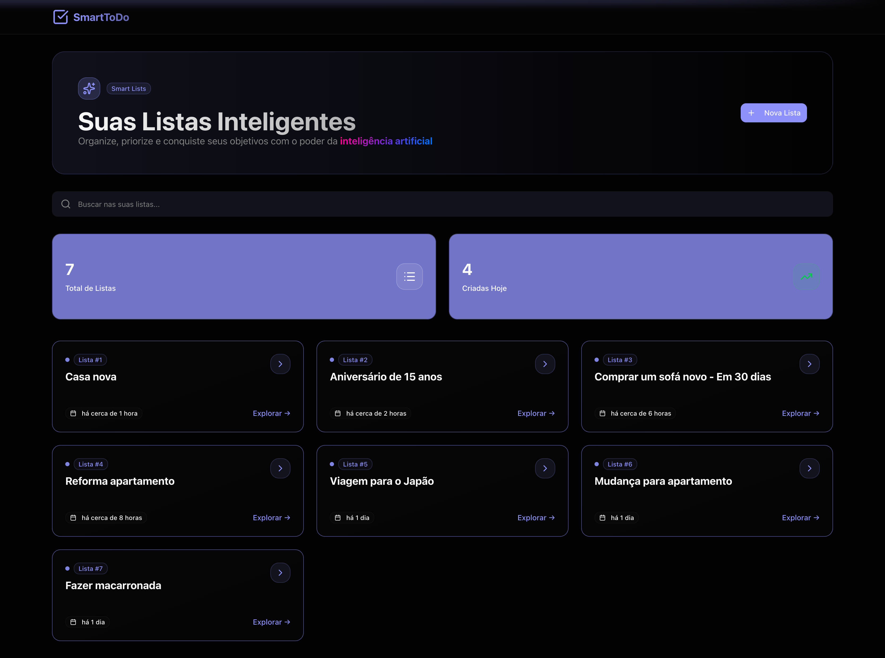
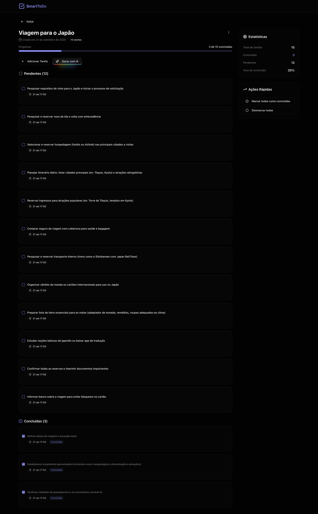

# 📌 SmartToDo


SmartToDo é uma aplicação moderna de **listas de tarefas inteligentes** que utiliza **Inteligência Artificial** para ajudar você a organizar, priorizar e conquistar seus objetivos de forma prática e eficiente.

✨ Com o **SmartToDo** você pode:
- Criar listas personalizadas.
- Adicionar e organizar tarefas.
- Gerar tarefas automaticamente com IA.
- Acompanhar progresso e estatísticas em tempo real.

---

## 🚀 Tecnologias Utilizadas

- **Frontend:** [Next.js](https://nextjs.org/)
- **Backend:** [NestJS](https://nestjs.com/)
- **Banco de Dados:** SQLite
- **Integração com IA:** [OpenRouter](https://openrouter.ai/) (modelo `x-ai/grok-4-fast:free`)

---

## 📷 Screenshots

### 🔹 Página Inicial


### 🔹 Página de Detalhes da Lista


---

## ⚙️ Como Rodar Localmente

### 🔹 Frontend (Next.js)

1. Instale as dependências:
   ```bash
   npm install
   ```

2. Configure o arquivo `.env.local`:
   ```env
   NEXT_PUBLIC_API_URL=http://localhost:3001
   ```

3. Inicie o servidor de desenvolvimento:
   ```bash
   npm run dev
   ```

---

### 🔹 Backend (NestJS)

1. Instale as dependências:
   ```bash
   npm install
   ```

2. Configure o arquivo `.env`:
   ```env
   PORT=3001
   DATABASE_PATH=./data/sqlite.db
   LLM_MODEL="x-ai/grok-4-fast:free"
   LLM_BASE_URL="https://openrouter.ai/api/v1/chat/completions"
   ```

3. Inicie o servidor de desenvolvimento:
   ```bash
   npm run start:dev
   ```

---

## 🧠 Inteligência Artificial no SmartToDo

O **SmartToDo** permite gerar listas e tarefas automaticamente com IA, tornando o processo de organização mais rápido e prático. Basta fornecer um prompt e o sistema sugere tarefas relevantes para sua lista.

